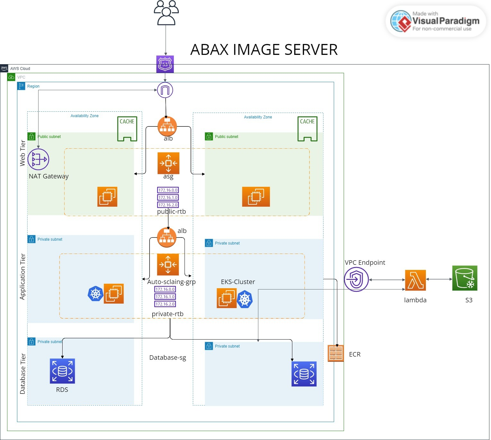

# Distributed Image Server Architecture

## Overview

The Image Server is a distributed system designed to efficiently handle image uploads and storage, with enhanced access speeds and optimized cost management. The system leverages various AWS services to create a resilient, scalable, and performant architecture.

## Traffic Flow

1. User Interaction:
   - Users upload images through the application interface, which communicates with the server infrastructure hosted on AWS.

2. Application Load Balancers (ALB):
   - The ALB acts as the entry point for all incoming traffic, distributing it across multiple EC2 instances within an Auto Scaling Group (ASG) to ensure high availability and fault tolerance.

3. Amazon EC2 & Amazon EKS:
   - The EC2 instances, orchestrated by the Amazon Elastic Kubernetes Service (EKS), run the application that processes the image uploads.
   - Container images are stored and managed in Amazon Elastic Container Registry (ECR), ensuring secure storage and version control.

4. Amazon S3:
   - Uploaded images are stored in an S3 bucket, a durable and scalable object storage service.
   - A lifecycle policy is applied to frequently accessed images to optimize costs and access speeds.

5. Amazon RDS:
   - The metadata of the users and images are stored in the Amazon Relational Database Service (RDS), allowing structured data storage and efficient retrieval.

6. AWS Lambda:
   - Upon image upload to S3, a Lambda function is triggered to automatically tag images, facilitating better management and retrieval.

7. Amazon Elasticache & Amazon CloudFront:
   - Amazon Elasticache provides in-memory caching for frequently accessed data, reducing latency and improving the response time of the application.
   - Amazon CloudFront is utilized as a Content Delivery Network (CDN) to cache images closer to users, further decreasing latency and improving load times.

8. Networking and Security:
   - The system is deployed within an Amazon Virtual Private Cloud (VPC), segmented into public and private subnets across multiple Availability Zones (AZs) to ensure network isolation and service availability.
   - NAT Gateways are used to enable outbound internet access for resources in private subnets.
   - Security Groups (SG) are applied to each service, acting as virtual firewalls that control the traffic to and from EC2, RDS, and other resources.
   - AWS Identity and Access Management (IAM):
   - IAM will be used to Manage access to AWS services and resources securely. We will Use IAM roles and policies to control which parts of our AWS architecture can communicate with each other.

9. AWS Route 53:
   - Amazon Route 53 provides a highly available and scalable Domain Name System (DNS) web service, directing users to the application through user-friendly domain names.

 10.  Amazon CloudWatch:
    - We will monitor the ImageServer application's performance and log system and application logs. Alarms and notifications will be used to respond to system-wide performance changes.

## Additional Features

- Auto Scaling: The system is capable of automatically adjusting the number of EC2 instances in response to traffic variations, ensuring consistent performance and cost efficiency.
- High Availability: Deployment across multiple AZs protects against single points of failure, ensuring the application remains operational even if one AZ becomes unavailable.
- Security and Compliance: The architecture is designed with security best practices, including the principle of least privilege and compliance with relevant data protection regulations.

## Conclusion

The distributed Image Server's architecture ensures a reliable, secure, and user-friendly platform for image uploads and storage. By utilizing AWS's robust cloud infrastructure and services, the system achieves high performance, scalability, and resilience.


### Proposed Architectural Diagram
```bash
Internet
   |
   v
Amazon API Gateway
   |
   v
AWS Lambda (Image Processing) <--> Amazon S3 Bucket (Image Storage)
   |                                             |
   v                                             v
Elastic Load Balancing (ALB)             Amazon CloudFront (CDN)
   |                                             ^
   v                                             |
Amazon EKS Cluster (ImageServer App)         |
   |                                             |
   v                                             |
Amazon RDS (Metadata Storage) <--> Amazon Elasticache
   |
   v
AWS Identity and Access Management (IAM)
   |
   v
Amazon CloudWatch
```

This architecture aims to be scalable, with the ability to handle varying loads efficiently, and reliable, ensuring high availability across all components. It leverages AWS managed services to reduce the operational overhead of managing infrastructure, allowing us to focus on developing and improving the application.

